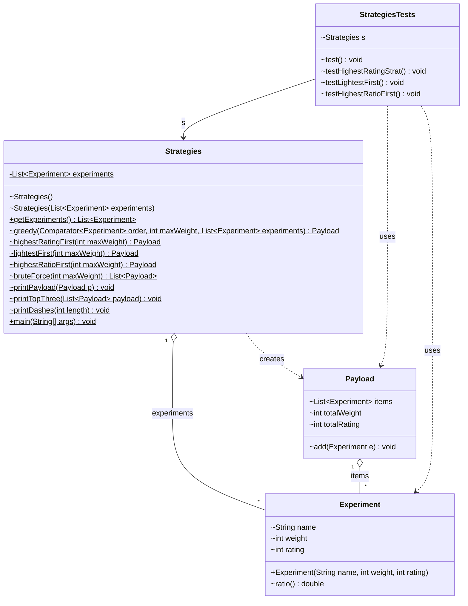

```mermaid
classDiagram
    class Experiment {
        ~String name
        ~int weight
        ~int rating
        +Experiment(String name, int weight, int rating)
        ~ratio() double
    }

    class Payload {
        ~List~Experiment~ items
        ~int totalWeight
        ~int totalRating
        ~add(Experiment e) void
    }

    class Strategies {
        -List~Experiment~ experiments$
        ~Strategies()
        ~Strategies(List~Experiment~ experiments)
        +getExperiments()$ List~Experiment~
        ~greedy(Comparator~Experiment~ order, int maxWeight, List~Experiment~ experiments)$ Payload
        ~highestRatingFirst(int maxWeight)$ Payload
        ~lightestFirst(int maxWeight)$ Payload
        ~highestRatioFirst(int maxWeight)$ Payload
        ~bruteForce(int maxWeight)$ List~Payload~
        ~printPayload(Payload p)$ void
        ~printTopThree(List~Payload~ payload)$ void
        ~printDashes(int length)$ void
        +main(String[] args)$ void
    }

    class StrategiesTests {
        ~Strategies s
        ~test() void
        ~testHighestRatingStrat() void
        ~testLightestFirst() void
        ~testHighestRatioFirst() void
    }

    Payload "1" o-- "*" Experiment : items
    Strategies "1" o-- "*" Experiment : experiments
    Strategies ..> Payload : creates
    StrategiesTests --> Strategies : s
    StrategiesTests ..> Payload : uses
    StrategiesTests ..> Experiment : uses
```
