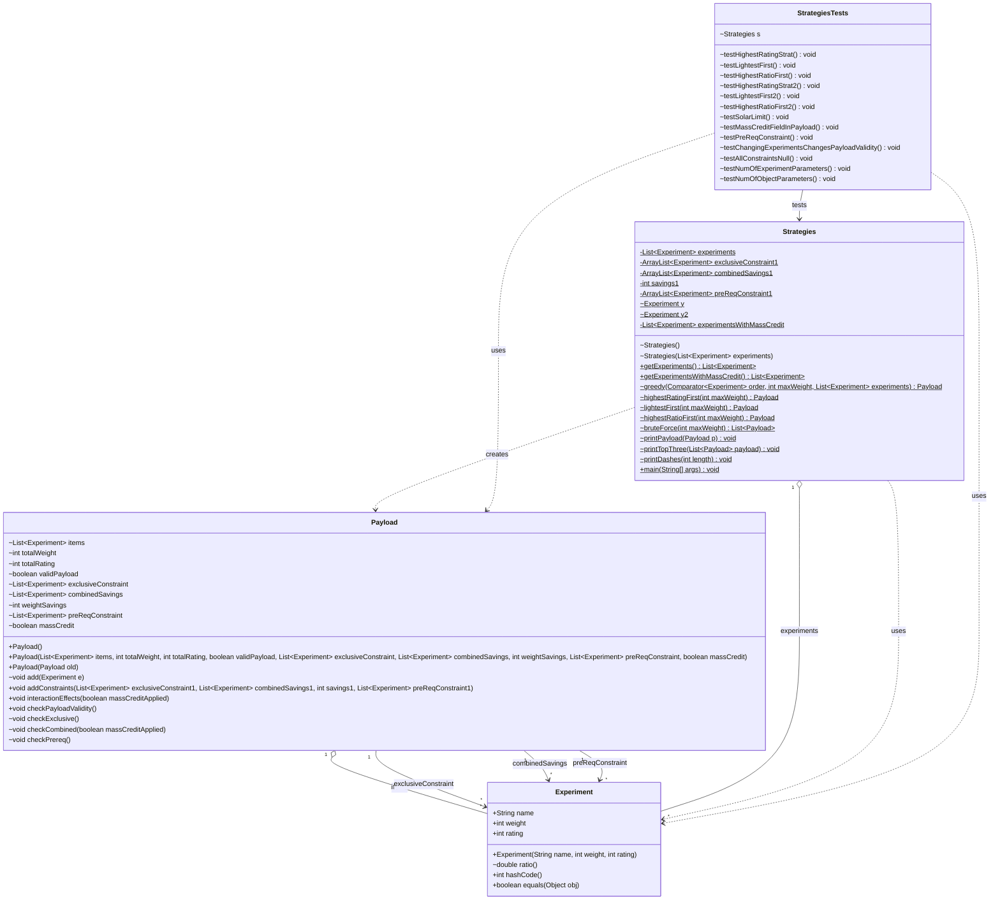

```mermaid
classDiagram
    class Experiment {
        +String name
        +int weight
        +int rating
        +Experiment(String name, int weight, int rating)
        ~double ratio()
        +int hashCode()
        +boolean equals(Object obj)
    }

    class Payload {
        ~List~Experiment~ items
        ~int totalWeight
        ~int totalRating
        ~boolean validPayload
        ~List~Experiment~ exclusiveConstraint
        ~List~Experiment~ combinedSavings
        ~int weightSavings
        ~List~Experiment~ preReqConstraint
        ~boolean massCredit
        +Payload()
        +Payload(List~Experiment~ items, int totalWeight, int totalRating, boolean validPayload, List~Experiment~ exclusiveConstraint, List~Experiment~ combinedSavings, int weightSavings, List~Experiment~ preReqConstraint, boolean massCredit)
        +Payload(Payload old)
        ~void add(Experiment e)
        +void addConstraints(List~Experiment~ exclusiveConstraint1, List~Experiment~ combinedSavings1, int savings1, List~Experiment~ preReqConstraint1)
        +void interactionEffects(boolean massCreditApplied)
        +void checkPayloadValidity()
        ~void checkExclusive()
        ~void checkCombined(boolean massCreditApplied)
        ~void checkPrereq()
    }

    class Strategies {
        -List~Experiment~ experiments$
        -ArrayList~Experiment~ exclusiveConstraint1$
        -ArrayList~Experiment~ combinedSavings1$
        -int savings1$
        -ArrayList~Experiment~ preReqConstraint1$
        ~Experiment y$
        ~Experiment y2$
        -List~Experiment~ experimentsWithMassCredit$
        ~Strategies()
        ~Strategies(List~Experiment~ experiments)
        +getExperiments()$ List~Experiment~
        +getExperimentsWithMassCredit()$ List~Experiment~
        ~greedy(Comparator~Experiment~ order, int maxWeight, List~Experiment~ experiments)$ Payload
        ~highestRatingFirst(int maxWeight)$ Payload
        ~lightestFirst(int maxWeight)$ Payload
        ~highestRatioFirst(int maxWeight)$ Payload
        ~bruteForce(int maxWeight)$ List~Payload~
        ~printPayload(Payload p)$ void
        ~printTopThree(List~Payload~ payload)$ void
        ~printDashes(int length)$ void
        +main(String[] args)$ void
    }

    class StrategiesTests {
        ~Strategies s
        ~testHighestRatingStrat() void
        ~testLightestFirst() void
        ~testHighestRatioFirst() void
        ~testHighestRatingStrat2() void
        ~testLightestFirst2() void
        ~testHighestRatioFirst2() void
        ~testSolarLimit() void
        ~testMassCreditFieldInPayload() void
        ~testPreReqConstraint() void
        ~testChangingExperimentsChangesPayloadValidity() void
        ~testAllConstraintsNull() void
        ~testNumOfExperimentParameters() void
        ~testNumOfObjectParameters() void
    }

    Payload "1" o-- "*" Experiment : items
    Payload "1" --> "*" Experiment : exclusiveConstraint
    Payload "1" --> "*" Experiment : combinedSavings
    Payload "1" --> "*" Experiment : preReqConstraint

    Strategies "1" o-- "*" Experiment : experiments
    Strategies ..> Payload : creates
    Strategies ..> Experiment : uses

    StrategiesTests --> Strategies : tests
    StrategiesTests ..> Payload : uses
    StrategiesTests ..> Experiment : uses
```
